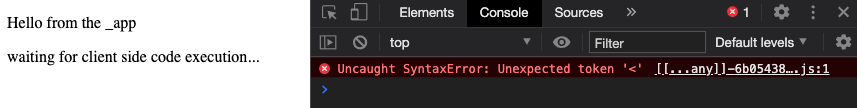

# Minimal set up for reproducing the next-on-netlify catch-all bug

The problem with this set up is that the `pages/[[...any]].jsx` is not served properly by Netlify.
It is being rendered on the server correctly, because the `pages/_app.jsx` uses `getInitialProps` 
(which forces all pages to be rendered on the server).

When the page is being accessed it first correctly renders on the server.
Then next tries to fetch the JS chunk corresponding to the `pages/[[...any]].jsx` page.
It seems this chunk is again executed on the server resulting in pre-rendered HTML to be returned instead of JS.

> At the time of writing the Netlify deployment can be accessed at https://condescending-allen-4992da.netlify.app/


The browser then tries to parse the result as JS which fails with a syntax error.



## Workaround

There is a known workaround using a specific catch-all redirect 
(see https://github.com/netlify/next-on-netlify/issues/41#issuecomment-695353233).

To make it work a special catch-all redirect must be added to the `_redirects` file:

```
/_next/* /_next/:splat 200
```
